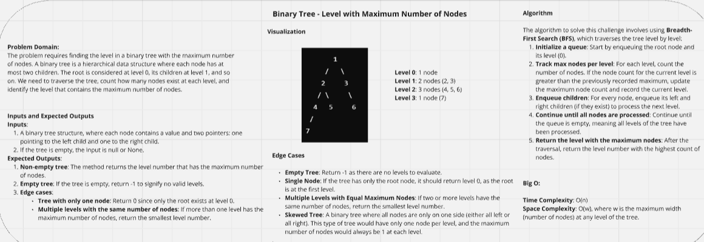
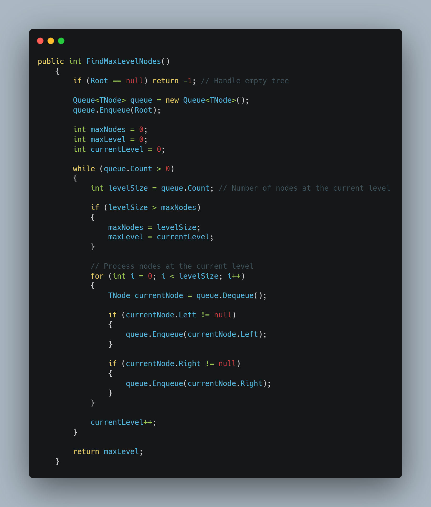
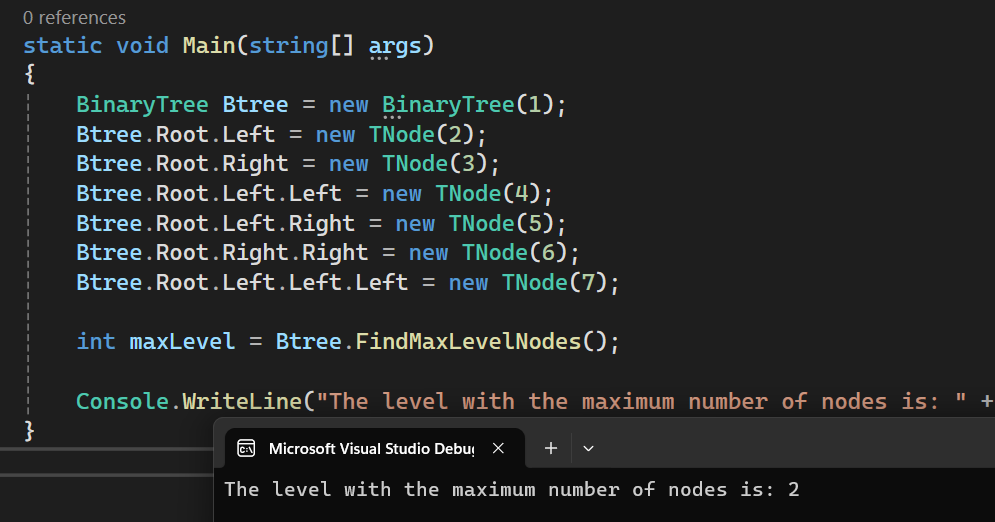

### Data Structures Whiteboard Images

### Binary Tree - Level with Maximum Number of Nodes

### Binary Tree - Level with Maximum Number of Nodes code

### Binary Tree - Level with Maximum Number of Nodes Main method

